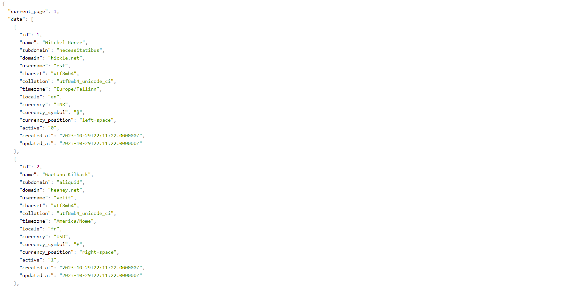

## About SaaS Starter Kit

SaaS Starter Kit is a Laravel 10 based application that can be used to quickly build a SaaS application. It is built using Laravel:

## Feature List

1. Tenant Management
2. Endpoint file (routes/tenants.php) for each tenant
3. Tenant specific subdomain
4. Tenant specific domain
5. Users, Themes, Orders, Products, Settings tables.
6. Endpoint to fetch tenants
7. Endpoint to fetch users of a tenant

## Installation

Before you begin, make sure you have the following prerequisites:

1. PHP >= 8.1
2. Composer >= 2.1.3
3. MySQL >= 8.0.25

To install SaaS Starter Kit, follow these steps:

Clone the repository:

    git clone

Install dependencies:

    composer install

Copy .env.example to .env:

    cp .env.example .env

Generate application key:

    php artisan key:generate

Create a database and update .env file with database credentials:

    DB_CONNECTION=mysql
    DB_HOST=
    DB_PORT=
    DB_DATABASE=
    DB_USERNAME=
    DB_PASSWORD=

Run migrations:

    php artisan migrate --seed

OR

    php artisan migrate:fresh --seed

Run the application:

    php artisan serve

This command will start the Laravel development server, and you'll see an output similar to this:

    Laravel development server started: http://127.0.0.1:8000

Your Laravel project is now running locally. You can access it by opening a web browser and navigating to http://127.0.0.1:8000 or http://localhost:8000.

## Endpoints

### Tenants

#### Fetch all tenants

    GET /api/v1/tenants

#### Fetch users of a tenant

    GET /api/v1/tenants/{tenant}/users
    

## License

The SaaS Starter Kit is open-sourced software licensed under the [MIT license](https://opensource.org/licenses/MIT).
